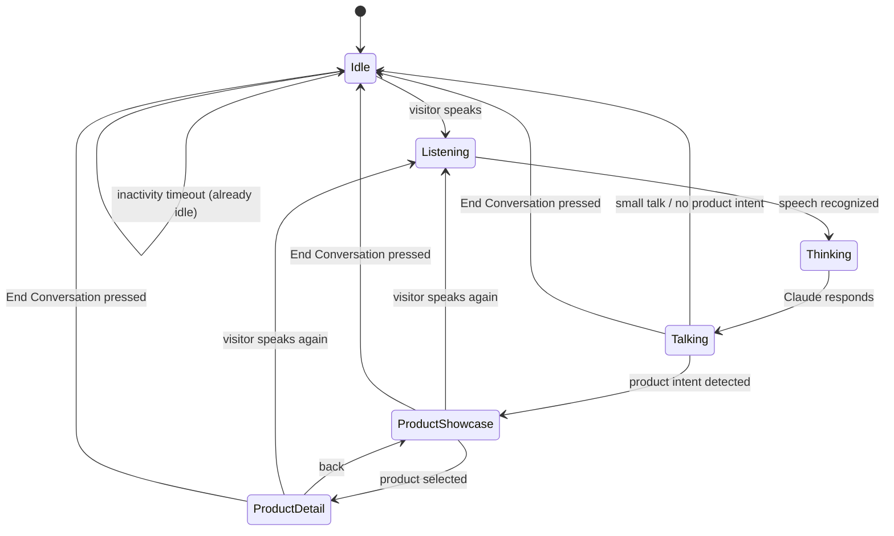
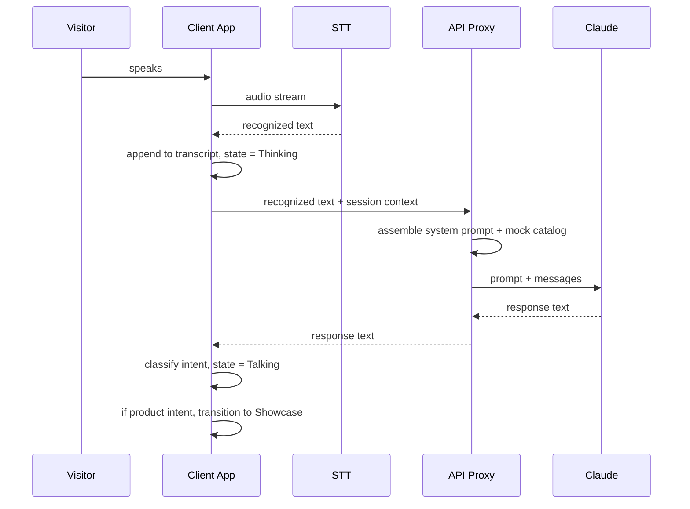

# Software Requirements Specification (SRS)

## Aurora — AI Avatar Builder Platform for Transparent OLED Displays

**Version:** 2.0
**Status:** Draft for Approval
**Supersedes:** `02-SRS.docx` (v1.0)
**Companion documents:** `01-PRD.md`, `03-UIUX-Spec.md`

---

## 1. Introduction

This SRS defines the technical requirements for **Version 0.1 (MVP)** of Aurora, a single-avatar, voice-first digital human demonstration running on a vertical transparent OLED display, and separately documents the future multi-tenant platform architecture it must not preclude. Where a requirement applies only to the future platform, it is explicitly marked **[Future]**.

## 2. Overall Description

The MVP is a single-page, client-heavy application with one narrow server-side responsibility: proxying calls to the Claude API so no API key is ever exposed to the display device. There is no database, no user accounts, and no multi-tenant logic in V0.1. The application runs as a kiosk-mode browser session on (or connected to) the transparent OLED unit, in portrait orientation, and is driven entirely by voice.

Two participants exist in the MVP:
- **The visitor**, who speaks to the display and sees the avatar/products/transcript.
- **The demo operator**, who has no dedicated UI in V0.1 — the End Conversation control is on-screen and visitor-facing, not an operator console.

## 3. Architecture

```
┌──────────────────────────────────────────────────────────┐
│  Transparent OLED Display (Portrait, White Cabinet)       │
│  ┌──────────────────────────────────────────────────────┐ │
│  │  Client Application (browser, kiosk mode)             │ │
│  │  - Microphone capture → STT                            │ │
│  │  - UI State Machine (Idle/Listening/.../Showcase)       │ │
│  │  - Avatar renderer                                      │ │
│  │  - Product Showcase / Detail renderer                   │ │
│  │  - Transcript panel                                     │ │
│  │  - Advertisement rotator                                 │ │
│  │  - Local mock product/ad JSON                            │ │
│  └───────────────────────┬──────────────────────────────┘ │
└──────────────────────────┼─────────────────────────────────┘
                           │ recognized text
                           ▼
                 ┌───────────────────────┐
                 │  Thin API Proxy        │
                 │  (holds Claude key,    │
                 │   assembles system     │
                 │   prompt + catalog)    │
                 └──────────┬────────────┘
                            │
                            ▼
                 ┌───────────────────────┐
                 │   Claude API           │
                 └───────────────────────┘
```

**[Future]** the same client shape is retained, but the proxy grows into a full **AI Engine Service** behind an `LLMService` interface, sitting alongside a Crawler/Indexing Service, Product Extraction Service, Retrieval Service, Analytics Service, and Admin Web App, serving many tenants instead of one hardcoded avatar.

## 4. System Modules (V0.1)

| Module | Responsibility |
|---|---|
| Avatar Renderer | Renders Nova and its Idle/Listening/Thinking/Talking animation states |
| Speech Capture (STT) | Captures microphone audio, produces recognized text, feeds the transcript |
| Conversation Engine | Sends recognized text + short-term context to the API proxy, receives Claude's reply |
| Product Catalog (mock) | Local JSON of ~10–15 products; queried by category/name for showcase and detail views |
| Product Showcase | Renders the product grid and orchestrates the avatar-shrink transition |
| Product Detail | Renders a single product's full view |
| Transcript Panel | Bottom, translucent, toggleable log of the conversation |
| Voice Controls | Floating mic button; End Conversation button |
| Advertisement Rotator | Cycles mock images/video/banners during Idle Mode |
| State Machine | Owns the Idle/Listening/Thinking/Talking/Showcase/Detail transitions and idle-timeout return |

## 5. Application States



Notes:
- **End Conversation** is reachable from every non-idle state and always returns directly to Idle: clears transcript/context, enlarges the avatar, resumes Advertisement Mode.
- An inactivity timeout from any conversational/product state, with no End Conversation press, also returns to Idle (graceful auto-close, not just a manual control).

## 6. Conversation Flow

1. Visitor speech is captured and transcribed (Section 7).
2. Recognized text plus the current session's short-term conversation context is sent to the Conversation Engine.
3. The Conversation Engine assembles a system prompt (Nova's persona + strict catalog-grounding instructions + the mock catalog itself) and calls Claude via the API proxy.
4. Claude's reply is classified for intent by the Conversation Engine before rendering:
   - **Small talk / greeting / thanks / goodbye** → Talking state, no view change.
   - **Product-related** → Talking state, then transition to Product Showcase with the matched category/products.
   - **Out-of-domain** → Claude is instructed to politely redirect rather than answer; UI stays in Talking, no product transition.
5. Session context (recent turns, last-referenced products) persists only for the duration of the current conversation; it is discarded on End Conversation or idle-timeout return.

## 7. Speech Recognition Flow

1. Visitor speech starts (voice activity detected, or mic button pressed) → state moves to Listening; advertisements (if playing) stop immediately.
2. Audio is streamed to the STT engine; interim/partial results may update a live "listening" indicator but are not sent to Claude until finalized.
3. On a finalized transcript segment: the text is appended to the Transcript panel (if visible or not — the transcript always records, display is independent of the toggle) and handed to the Conversation Flow (Section 6).
4. If STT fails to produce a usable transcript (silence timeout, unrecognized audio), the avatar returns to Idle-equivalent listening readiness with a brief, on-brand spoken/visual cue — never a frozen "Listening…" state.

## 8. Product Search Flow

1. Claude's reply is checked against the mock catalog's category and product-name index (exact/fuzzy match on the terms Claude used or on the visitor's own recognized text).
2. A match promotes the UI from Talking directly into Product Showcase, passing the matched category (or matched single product, which may go straight to Product Detail — e.g., "tell me about the Aria 14").
3. No match for a clearly product-shaped request → Claude states the item isn't available in the current catalog; UI remains in Talking, no showcase transition (the MVP must never fabricate a product to satisfy a showcase transition).
4. From Product Showcase, selecting a card moves to Product Detail; a "back" action returns to Showcase; the avatar remains visible and continues narrating across both.

## 9. Advertisement Flow

1. On entering Idle, the Advertisement Rotator begins cycling local mock media (images/video/banners) on a fixed interval.
2. The avatar is large and centered; it may periodically deliver a short scripted greeting/invitation during Idle without this counting as a "conversation."
3. The instant voice input is detected (even before a full transcript resolves), Advertisement Mode halts and the state machine moves to Listening — no lag, no waiting for the current ad to finish.
4. Returning to Idle (via End Conversation or inactivity timeout) resumes the Advertisement Rotator from the next item in its cycle.

## 10. Future Website Indexing Flow **[Future]**

1. A company submits one or more website URLs via the (future) Avatar Creation Studio.
2. A Crawler/Indexing Service fetches pages up to a configured depth, respecting `robots.txt`.
3. Pages are classified (product, category, FAQ, About, support, documentation, other).
4. Non-product content is cleaned, chunked, and embedded into a semantic index for general Q&A grounding.
5. Product-classified pages are routed to Product Extraction (Section 11).
6. Indexing run metadata (timestamp, page/product counts, errors) is logged for admin review.

## 11. Future Product Extraction Flow **[Future]**

1. Product-classified pages are parsed into structured records (name, category, description, price, image URL, source URL, specs, keywords).
2. Records are persisted as versioned CSV (or equivalent structured storage) per tenant/site/run, replacing the MVP's static mock JSON.
3. A diff report between consecutive runs is generated for admin review before the catalog is published live.
4. The published catalog becomes the grounding source for that tenant's avatar, exactly as the mock JSON does in V0.1 — the retrieval and grounding *rules* do not change between MVP and future platform, only the *source* of the data does.

## 12. Future Avatar Creation Flow **[Future]**

1. An admin opens the Avatar Creation Studio and configures: company name, logo, avatar name, gender, voice, appearance, clothing, personality, greeting, brand colors, supported languages, connected website URL(s), and knowledge sources.
2. The studio validates required fields and triggers an initial indexing run (Section 10) if URLs were provided.
3. The new avatar is assigned to one or more display sessions/tenants.
4. All V0.1 conversational rules (catalog-grounding, persona constraints, out-of-domain redirection) apply per-avatar, driven by that avatar's own configuration instead of Nova's hardcoded persona.

## 13. Data Flow (V0.1)



## 14. State Diagrams

See Section 5 for the primary application state diagram. A secondary, avatar-only animation state diagram (Idle/Listening/Thinking/Talking as visual/motion states independent of which screen is showing) is specified in `03-UIUX-Spec.md`, Section on Avatar Behaviour.

## 15. Component Breakdown

- `AvatarStage` — renders Nova and its four animation states; exposes a `compact` mode for the showcase/detail layout.
- `AdvertisementRotator` — cycles mock ad content during Idle.
- `ProductShowcase` — grid of product cards (image, name, price only).
- `ProductDetail` — single product deep-dive.
- `TranscriptPanel` — bottom, translucent, toggleable conversation log.
- `VoiceControls` — floating mic button + End Conversation button.
- `ConversationEngine` — owns the STT → Claude → intent-classification pipeline.
- `AppStateMachine` — the orchestrating state owner described in Section 5.
- `MockCatalogService` — reads/queries the local product JSON.
- `MockAdService` — reads/queries the local ad/media JSON.

## 16. Folder Structure (Recommended, V0.1)

```
aurora-mvp/
├── src/
│   ├── data/               # mock products.json, ads.json
│   ├── store/              # app state machine (conversation, UI state)
│   ├── features/
│   │   ├── avatar/         # AvatarStage + animation states
│   │   ├── ads/            # AdvertisementRotator
│   │   ├── products/       # ProductShowcase, ProductDetail
│   │   ├── transcript/     # TranscriptPanel
│   │   └── voice/          # mic capture, VoiceControls, End Conversation
│   ├── conversation/       # ConversationEngine, intent classification
│   └── screens/            # top-level orchestrator screen
├── server/                 # thin API proxy holding the Claude key
└── docs/                   # this document set
```

This structure is organized by feature, not by file type, so the future platform can add `features/avatar-studio/`, `features/indexing/`, etc. alongside the existing modules without restructuring what V0.1 already built.

## 17. Technology Stack

- **Client:** a component-based frontend framework with a small central store for the state machine (conversation/UI state), and a motion/animation library for the avatar and screen transitions — matching the stack already validated in the project's interactive prototype.
- **Speech recognition:** browser-native speech recognition for the MVP demo; flagged as a candidate for replacement by a dedicated STT service if kiosk reliability (continuous listening, noise handling) proves insufficient on the real hardware.
- **LLM:** Claude, called exclusively through the thin API proxy — never directly from the client, to avoid exposing the API key on a physically accessible kiosk device.
- **Data:** local JSON files for products and advertisement media; no database in V0.1.
- **Hosting:** the client runs in kiosk-mode browser on (or connected to) the transparent OLED unit; the API proxy can run on minimal infrastructure (a single small server/function) since it does no persistence.

## 18. Security Considerations

- The Claude API key must never be embedded in client-side code — the API proxy exists specifically to prevent this on a physically-accessible kiosk device.
- The microphone must have a clear, always-visible listening indicator so visitors know exactly when audio is being captured — a trust and privacy requirement, not just a UX nicety.
- No audio or transcript is persisted beyond the current session in V0.1 — conversation context is cleared on End Conversation or idle-timeout, and nothing is written to disk or a database.
- **[Future]** multi-tenant data isolation, role-based admin access, and device-scoped credentials per physical display become required once the platform is multi-company.

## 19. Performance Requirements

- Voice round-trip (end of visitor speech → start of avatar's visible response) should feel conversational — avoid any perceptible dead air between Thinking and Talking.
- Screen transitions (avatar shrink, product entrance) must run smoothly at the display's native refresh rate; no dropped frames during the signature showcase transition.
- Advertisement-to-conversation interruption (Section 9) must be near-instantaneous — this is the moment that sells the "it's alive and listening" impression.

## 20. Maintainability

- Claude access sits behind a single interface in the API proxy so a different model or provider could be substituted later without touching client code — directly supporting the Future Platform's multi-provider ambitions without requiring V0.1 to build that abstraction prematurely.
- The mock catalog and mock ad data are isolated in their own data module specifically so they can be swapped for the future Retrieval Service / Product Extraction output without touching the UI components that consume them.

## 21. Scalability

V0.1 is explicitly single-avatar, single-session, single-tenant, and is not required to scale. **[Future]** the platform must support many independent tenant deployments, each with isolated avatars, catalogs, and conversation history, without cross-tenant data leakage — this drives the Future Architecture in Section 22, but is out of scope for anything built against this SRS today.

## 22. Future Architecture **[Future]**

The future platform architecture (Admin Web App, API Gateway, Crawler/Indexing Service, Product Extraction Service, Retrieval Service, AI Engine Service, Analytics/Logging Service, per-tenant Media Storage) is described at a high level here for continuity of vision; a dedicated future-state SRS should be written once the MVP validates the core experience, rather than building this architecture speculatively now.

## 23. Error Handling

- **STT failure/silence:** return to a ready-to-listen state with a brief on-brand cue; never leave the UI stuck on "Listening…".
- **Claude API failure/timeout:** the avatar delivers a graceful, on-brand fallback line (e.g., "I'm having trouble right now — one moment") rather than freezing or showing a raw error.
- **No catalog match for a clearly product-shaped query:** Claude states the item isn't available; no fabrication, no broken showcase transition.
- **Network loss:** the client shows a minimal, branded "reconnecting" treatment rather than a broken or blank screen.

## 24. Assumptions

- The demo environment has reliable internet access for the Claude API call.
- A microphone with reasonable ambient-noise rejection is available at the demo location.
- The mock product/ad data is prepared and approved before stakeholder demos.

## 25. Limitations

- V0.1 has no persistence — closing the session loses all conversation history by design.
- V0.1 supports English only.
- V0.1 has no admin interface; all configuration (persona, catalog, ads) is static and edited directly in source data files.
- V0.1 is not multi-tenant and is not intended for simultaneous use by more than one visitor/session.
